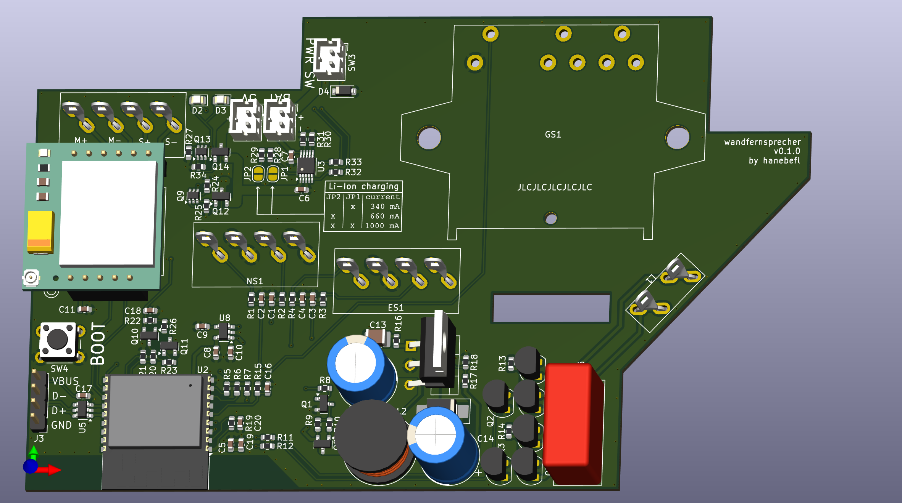

# GSM Wandfernsprecher
GSM conversion PCB for an old German wall-mounted telephone.

This project uses a SIM800L GSM module, and is controlled by a ESP32-C3 running Micropython.

## Firmware Source Code
The firmware is located in a separate repository: [Wandfernsprecher Firmware](https://github.com/hanebefl/wandfernsprecher-fw)

## Directory Structure
| directory  | content                                                              |
|------------|----------------------------------------------------------------------|
| source     | KiCad project directories                                            |
| production | fabrication files (Gerber, BOM, placement)                           |
| exports    | schematic and layout plots, board 3D model and renderings            |
| datasheets | component datasheets                                                 |
| assets     | board setups, component 3D models, logos                             |
| scripts    | BOM export plugins, miscellaneous helper scripts for file conversion |
| hooks      | git hooks, for example for automatic documentation export            |

## Repository Template
Created with a [KiCAD project template](https://github.com/cyber-murmel/kicad-template) by [cyber-murmel](https://github.com/cyber-murmel)
